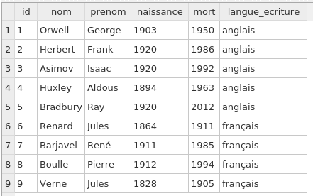
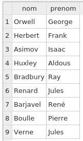
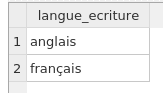
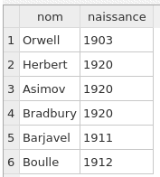
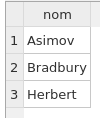
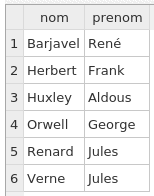
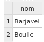
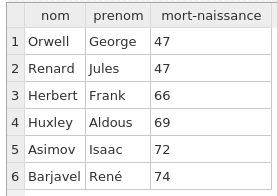
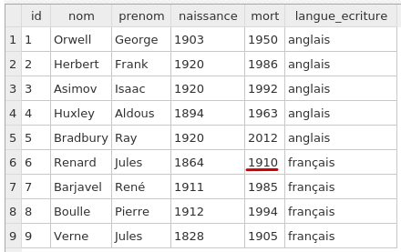
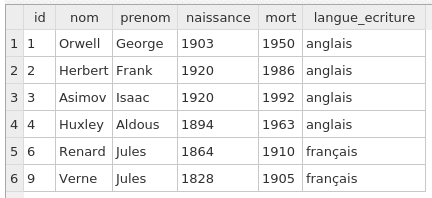

Terminale NSI

TP langage SQL
==============

Téléchargez tout d\'abord la base de données SQLite
[auteurs.db](auteurs.db).

Travail à faire :
=================

Vous mettrez au point les 10 requêtes SQL, les rassemblerez dans un
fichier texte qui devra être nommé *votrenom.sql*

Liste des requêtes SQL à mettre au point :
------------------------------------------

1.  Sélection de la table complète des auteurs
2.  Sélection de l\'ensemble des noms et prénoms des auteurs
3.  Sélection des langues d\'écriture (sans doublons !)
4.  Sélection des noms et années de naissance des auteurs nés après 1900
5.  Sélection des noms des auteurs nés en 1920, triés par ordre
    alphabétique
6.  Sélection des noms et prénoms des auteurs morts avant 1990, triés
    par ordre alphabétique des noms
7.  Sélection des noms des auteurs français nés après 1900
8.  Sélection des noms, prénoms et âges de décès des auteurs qui sont
    morts avant l\'âge de 75 ans, triés par âges de décès croissants
9.  Modification de la date du décès de Jules Renard (il est mort en
    1910 et non en 1911), puis sélection de la table complète des
    auteurs
10. Suppression dans la table de tous les auteurs dont le nom commence
    par la lettre **B**, puis sélection de la table complète des auteurs

------------------------------------------------------------------------

Aide :
------

Pour importer votre base de données dans *DB Browser for SQLite*, il
suffit de lancer le logiciel puis de cliquer sur le bouton **Ouvrir une
base de données**, et ensuite de sélectionner le fichier *auteurs.db*.

Pour les questions 9 et 10, il suffit de séparer vos deux requêtes par
un point-virgule (sur la même ligne c\'est possible !)

Pour la question 10, voir l\'aide sur les
[wilcards](https://www.w3schools.com/sql/sql_wildcards.asp) en SQL

Voici les résultats attendus (captures d\'écrans de *DB Browser for
SQLite*) :

Requête n° 1 : 

Requête n° 2 : 

Requête n° 3 : 

Requête n° 4 : 

Requête n° 5 : 

Requête n° 6 : 

Requête n° 7 : 

Requête n° 8 : 

Requête n° 9 : 

Requête n°10 : 

[Solutions](requetes-auteurs.sql)
