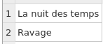
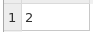
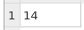
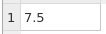
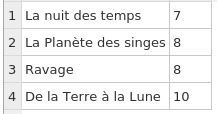
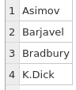
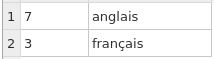
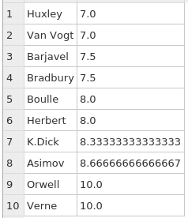
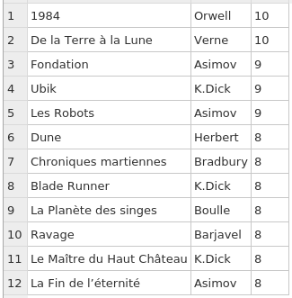

# TP SQL n°2

# Bases de données multitables

Notions abordées :
- Clés étrangères (foreign keys)
- Jointures (uniquement `INNER JOIN` en spécialité NSI)

Commencez par télécharger la base de données SQLite :  [db_livres_auteurs.db](db_livres_auteurs.db) 

Avec `sqlite3`, utilisez la commande interne :

    .schema

pour afficher les **schémas des tables** et repérer :
- les clés primaires ;
- les clés étrangères (relations entre les tables).

# Travail à faire :

1) Vous mettrez au point les 10 requêtes SQL et les rassemblerez dans un fichier texte (extension `.sql`)

2) Les résultats des requêtes seront redirigées par *sqlite3* en ligne de commande vers un fichier `resultats.txt`, avec des commentaires (utilisez la fonction interne `.print`)

## Liste des requêtes SQL à mettre au point :

1.  Affichage des titres des romans de Barjavel présents dans la base de données
2.  Affichage du nom et du prénom de l'auteur du roman "1984", avec l'année de publication
3.  Affichage du nombre de romans de Bradbury présents dans la base de données
4.  Affichage du nombre total de romans dont les auteurs sont nés après 1900
5.  Affichage de la moyenne des notes des romans de Barjavel
6.  Affichage des titres des romans écrits en français, avec leur note
7.  Affichage des noms des auteurs qui ont au moins deux romans dans la base de données
8.  Affichage des nombres d'auteurs par langue d'écriture
9.  Affichage des noms d'auteurs avec leurs moyennes, triés par moyennes croissantes
10.  Affichage des titres de romans, avec le nom de leur auteur et leur note, ayant une note supérieure ou égale à 8, triés par notes décroissantes

----------

## Aide :

Vous aurez à utiliser `INNER JOIN ...ON` et `GROUP BY ... HAVING`. Reportez-vous à la documentation en ligne.

Voici les résultats attendus (captures d'écrans de _DB Browser for SQLite_) :

Requête n° 1 : 

Requête n° 2 : 

Requête n° 3 : 

Requête n° 4 : 

Requête n° 5 : 

Requête n° 6 : 

Requête n° 7 : 

Requête n° 8 : 

Requête n° 9 : 

Requête n°10 : 
