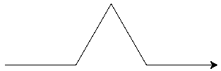
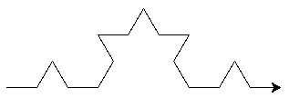
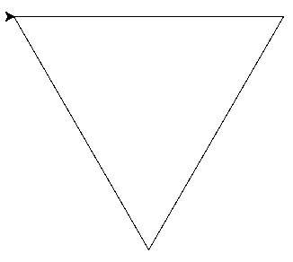
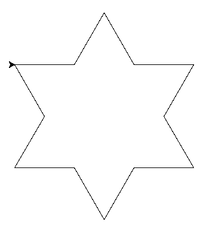

# Correction contrôle récursivité
## Exercice 1

```python
def puissance_iter(x, n):
   resultat = 1
   for i in range(n):
       resultat *= x
   return resultat


def puissance_recur(x, n):
   if n == 0:
       return 1
   else:
       return x * puissance_recur(x, n - 1)
```

## Exercice 2
1. `0`
2. `1`
3. `3`
4. `6`
5. La somme des entiers de 0 à n

## Exercice 3
1. Rien (en fait un espace suivi d'un saut de ligne)
2. `0 1 `
3. `20 21 22 23`
4. m - n + 2
## Exercice 4
1.
```
	4 6
	5 5
```
2.
```
	4 7
	5 6
```
3.
```
	4 4
```
4. Rien
5.  ligne 2 : `if n >= m:`

## Exercice 5
1. 
2. 300 pixels
3. 
4. 300 pixels
5. 
6. 
