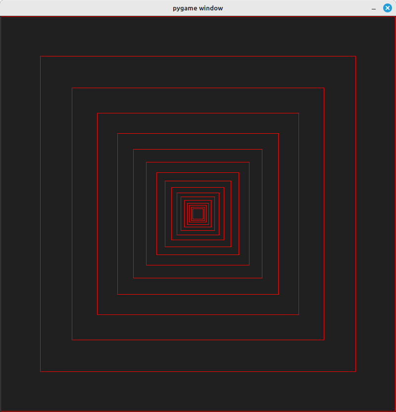
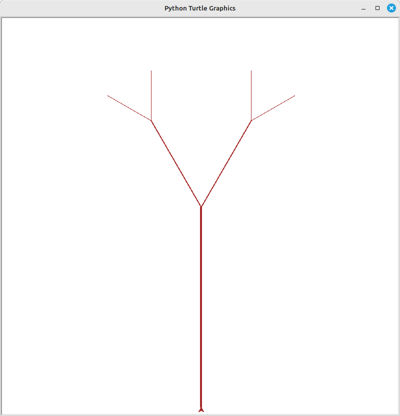
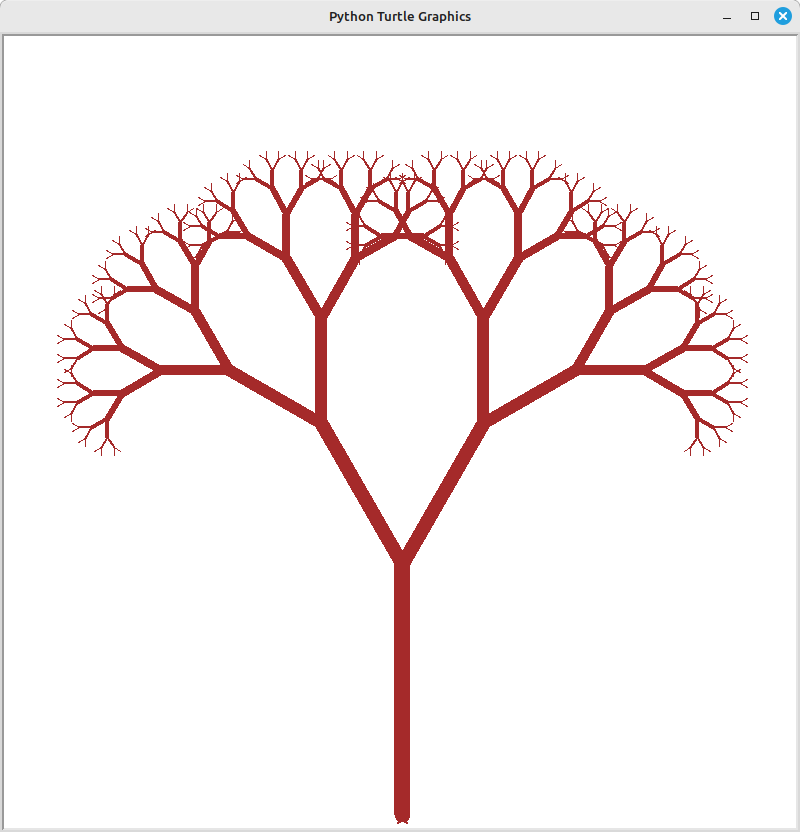

-   [Récursivité](#récursivité)
    -   [Introduction](#introduction)
    -   [Premiers exercices de
        conception](#premiers-exercices-de-conception)
    -   [Projets en mode graphique](#projets-en-mode-graphique)


# Récursivité

[](https://writteninmusic.com/wp-content/uploads/2011/09/cover-pink-floyd-ummagumma-1024x1024.jpg)

## Introduction

### Définition : fonction récursive {#définition--fonction-récursive}

> une fonction est **récursive** si elle fait appel à elle-même lors de
> son exécution.

L'idée sous-jacente de la **récursivité** est que pour résoudre un
problème ou effectuer un calcul, on se ramène à la résolution d'un
problème similaire mais de complexité moindre. On recommence ainsi
jusqu'à obtenir un problème élémentaire que l'on sait résoudre

### Exemple de base

``` language-python
def  f1():
    return  f1()

f1()
```

Dans *Thonny*, positionnez un **point d'arrêt** sur la dernière ligne
puis exécutez le programme en passant par ce point 5 ou 6 fois en mode
**pas à pas détaillé (F11)**.

-   Qu'observe t-on dans le *débugger* ?
-   Que fait ce programme quand on l'exécute "normalement" ? Quel est le
    message d'erreur affiché ?

### Condition d'arrêt

``` language-python
def f2(n):
    if n == 0:
        return
    else:
        return f2(n-1)

f2(4)
```

1.  Même expérimentation, toujours en positionnant le point d'arrêt en
    dernière ligne (regardez plus précisément le contenu de la variable
    `n` et la **PILE DES APPELS**)
2.  Utilisez ensuite [Python
    Tutor](https://pythontutor.com/python-compiler.html#mode=edit) pour
    visualiser le phénomène.

## Premiers exercices de conception

1.  Concevez une fonction `somme_de_1_a_n(n)` avec et sans récursivité :

``` language-bash
 >>>somme_de_1_a_n(4)
    10
    >>>
```

2.  Concevez une fonction **récursive** `affiche_de_n_a_zero(n)` :

``` language-bash
 >>>affiche_de_n_a_zero(4)
    4
    3
    2
    1
    0
    >>>
```

-   Utilisez le débogueur de *Thonny* puis *Python Tutor* pour analyser
    son fonctionnement
-   Programmez cette fonction **sans récursivité** et commentez

3.  Concevez une fonction récursive `affiche_de_m_a_n(m, n)` :

``` language-bash
 >>>affiche_de_m_a_n(5, 9)
    5
    6
    7
    8
    9
    >>>
```

4.  Complétez cette fonction récursive qui détermine si un nombre est
    premier :

``` language-python
def  est_premier(n, i=2):
    # Si n est inférieur à 2, il n'est pas premier
    if  ___ :
        return  False
    # Si n est divisible par i, il n'est pas premier
    if  ___ :
        return  False
    # Si i est supérieur à la racine carrée de n, n est premier
    if  ___ :
        return  True
    # Sinon, on continue à vérifier avec le prochain i
    return  est_premier( ___ )

print(est_premier(2)) # Affiche : True
print(est_premier(4)) # Affiche : False
print(est_premier(17)) # Affiche : True
```

## Projets en mode graphique

1.  Concevez un programme python faisant appel à une fonction récursive
    permettant d'obtenir dans une fenêtre **pygame** le résultat suivant
    :



3.  Complétez la fonction récursive de façon à obtenir des dessin
    d'arbres stylisés.

> L'appel de cette fonction avec les arguments suivants :
>
> ``` language-python
> arbre(2, 400, 30, 0.5)
> ```
>
> donnera le dessin suivant :\
> 

> L'appel de cette fonction avec les arguments suivants :
>
> ``` language-python
> arbre(8, 250, 30, 0.65)  
> ```
>
> donnera le dessin suivant :\
> 

Code à compléter :

``` language-python
import turtle as tt

def arbre(n, longueur, angle, facteur):
    if n == 0:
        tt.width(1)
        tt.___(longueur)
        tt.___(longueur)
    else:
        tt.width(2 * n)
        tt.___(longueur)

        tt.___(angle)
        arbre(___)

        tt.right(2 * angle)
        arbre(___)

        tt.___(angle)
        tt.___(longueur)

# Programme principal
tt.setup(800, 800)
tt.up()
tt.setpos(0, -380)
tt.left(90)

tt.down()
tt.color("brown")
arbre(2, 400, 30, 0.5)
# arbre(8, 250, 30, 0.65)

tt.mainloop()
```

> Indice : `backward` `forward` `left` `right`

