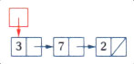
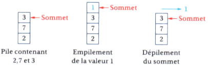
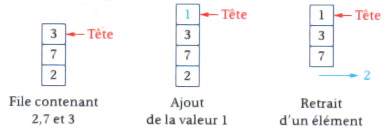
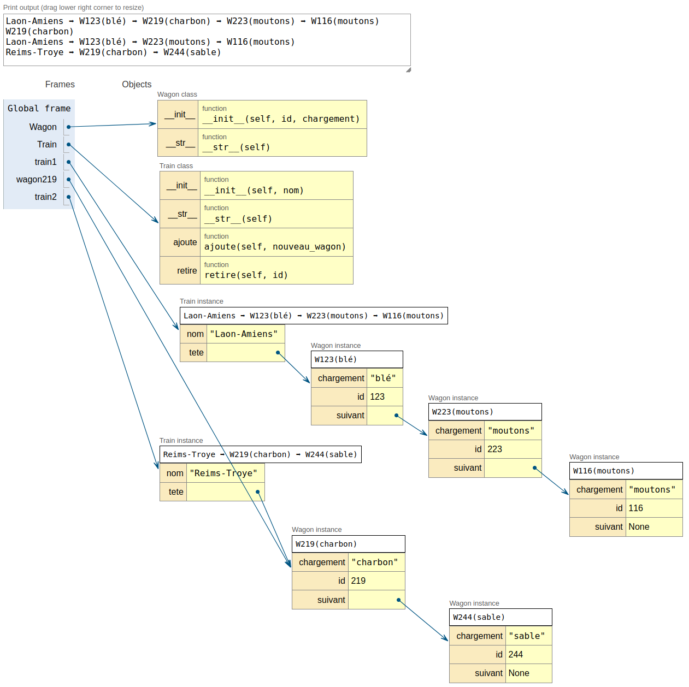
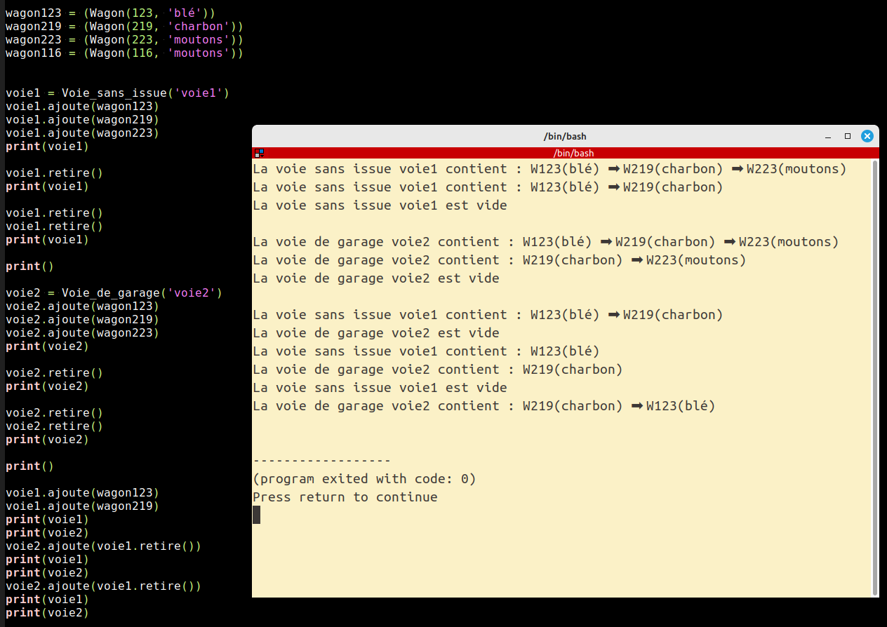

# Types abstraits

## I Structures de données, types abstraits 

- Une **structure de données** est une manière de stocker, d'accéder à, et de manipuler des données (comme les types `list` ou `dict` de Python). 

- L'interface de la structure de données décrit de quelle manière on peut la manipuler, par exemple en utilisant `append` pour le type `list` ou `get` pour le type `dict`. 

- L'implémentation de la structure de données, au contraire, contient le code de ces méthodes (comment fait Python). Il n'est pas nécessaire de connaître l'implémentation pour manipuler la structure de données. 

- Un type abstrait décrit essentiellement une interface, indépendamment du langage de programmation, avec éventuellement des précisions sur la complexité en temps et en espace des opérations. 

## II Listes 
- Une **liste** est composée de données et offre un moyen de passer à la donnée suivante. Les listes sont très souvent implémentées sous forme d'une chaîne de valeurs, chacune pointant vers la suivante (on parle alors de liste chaînée), comme sur la figure ci-dessous.

  

- Les opérations généralement disponibles sont : 

  - savoir si la liste est vide (`is_empty`) ; 

  - insérer un élément en tête de liste (`insert`) en temps constant ; 

  - récupérer l'élément en tête de liste (`head`) en temps constant ; 

  - récupérer la liste privée du premier élément (`tail`). 

- Il existe de multiples variantes de listes, mais le principe reste toujours plus ou moins identique. Cette structure est à la base de nombreuses autres. 

## III Piles 

Une **pile** (*stack* ou LIFO pour *last in, first out*) est une collection d'objets munie des opérations suivantes :

- Savoir si la pile est vide (`is_empty|`) ; 

- empiler un nouvel élément au sommet de la pile (`empiler, push`) en temps constant ; 

- dépiler l'élément au sommet de la pile et le renvoyer (`depiler, pop`) en temps constant (parfois, il y a deux opérations : une pour renvoyer le sommet de la pile sans le supprimer, et une pour simplement le supprimer). 

  

## IV Files 

Une **file** (*queue* ou FIFO pour *first in, first out*) est une collection d'objets munie des opérations suivantes : 

- savoir si la file est vide (is_empty) ; 

- ajouter un élément dans la file (enfiler ou enqueue) en temps constant ; 

- retirer et renvoyer l'élément le plus ancien de la file (defiler ou dequeue). 

  

## V Tableaux associatifs 

Un **tableau associatif** est un type abstrait qui associe des valeurs à des clés et est muni des opérations suivantes : 

- ajout d'une nouvelle valeur associée à une nouvelle clé ; 

- modification de la valeur associée à une clé existante ; 

- suppression d'une clé et de la valeur associée ; 

- récupération de la valeur associée à une clé donnée, 

>Remarque importante : chaque clé doit être unique dans le tableau associatif. 

---

## Applications

### Application n°1 : le train

#### Objectif 
À l'aide d'une [liste chaînée](https://fr.wikipedia.org/wiki/Liste_cha%C3%AEn%C3%A9e), représenter un train.

Chaque wagon aura un identifiant (nombre entier entre 100 et 999) et un chargement.

#### Deux classes seront nécessaires :
- la classe `Wagon`
   - *attributs :* `id, chargement, suivant`
   - *méthodes :* `__init__, __str__`
- la classe `Train`
   - *attributs :* `nom, tete`
   - *méthodes :* `__init__, __str__, ajoute, retire`

#### Code *Python* à compléter :

```python
class Wagon:
	def __init__(self, id, chargement):
		...

	def __str__(self):
		...


class Train:
	def __init__(self, nom):
		...

	def ajoute(self, nouveau_wagon):
		...

	def retire(self, id):
		...

	def __str__(self):
		...


################################################################
train1 = Train('Laon-Amiens')

train1.ajoute(Wagon(123, 'blé'))
train1.ajoute(Wagon(219, 'charbon'))
train1.ajoute(Wagon(223, 'moutons'))
train1.ajoute(Wagon(116, 'moutons'))

print(train1)

wagon219 = train1.retire(219)
print(wagon219)

print(train1)

train2 = Train('Reims-Troye')
train2.ajoute(wagon219)
train2.ajoute(Wagon(244, 'sable'))

print(train2)
```

**Résultat attendu :** (Python-tutor) après exécution de ce programme :



### Application n° 2 : encore le train
#### Objectif
Implémentation et utilisation de :
- pile *LIFO*
- file *FIFO*

#### 1) Implantation d'une pile *LIFO*

Complétez le code :
```python
class Pile:
   def __init__(self):
       self.elements = []

   def empiler(self, element):
       ...

   def depiler(self):
       ... (attention : il faut vérifier que la pile ne soit pas vide)

   def taille(self):
       ...

   def est_vide(self):
       ...
```

#### 1) Implantation d'une file *FIFO*

Complétez le code :
```python
class File:
  def __init__(self):
      self.elements = []

  def enfile(self, element):
      ...

  def defile(self):
      ... (attention : il faut vérifier que la pile ne soit pas vide)

  def taille(self):
      ...

  def est_vide(self):
      ...
```

#### 3) Utiliser une **pile** pour simuler un train (sans locomotive) de wagons garés
On considérera un ensemble de wagons sur une [voie sans issue](https://www.aupullman.com/media/catalog/product/cache/1/image/1001x801/aa7b5f6f0b641abb23a6b317faa7157c/b/u/bu8797.jpg)

- Implanter une classe `Voie_sans_issue` qui sera une *pile* d'objets `Wagons`
- ne pas oublier de définir `__str__` pour l'affichage, ainsi que toutes les méthodes vous paraissant nécessaires
- Contrôlez son bon fonctionnement

#### 4) Utiliser une **file** pour simuler un train (sans locomotive) de wagons garés
On considérera un ensemble de wagons sur une une *voie de garage* accessible des deux côtés (mais les wagons ne pourront arriver que d'une extrémité et repartir de l'autre)

- Implantez une classe `Voie_de_garage` qui sera une *file* d'objets `Wagons`
- ne pas oublier de définir `__str__` pour l'affichage, ainsi que toutes les méthodes vous paraissant nécessaires
- Contrôlez son bon fonctionnement

#### 5) Scénario

Vous mettrez au point un petit scénario (création de wagons, déplacements entre une voie de garage et deux voies sans issus par exemple...) pour illustrer l'utilisation de vos deux classes.

Voici un exemple d'utilisation des deux classes créés précédemment :



#### 6) Pour aller plus loin...

Affichage de votre scénario sous forme graphique (*pygame*)